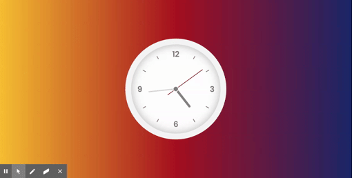

 

  <a href="https://github.com/govindk11/ColorGame">
    

  <h3 style="color: black;" align="center">Clock</h3>

  

    A Realtime Analog Clock
     
    <a href="https://govindcodes.github.io/Clock/"><strong>View Demo »</strong></a>
     
     
    <a href="https://github.com/GovindCodes/Clock/issues">Report Bug</a>
    ·
    <a href="https://github.com/GovindCodes/Clock/issues">Request Feature</a>
  

